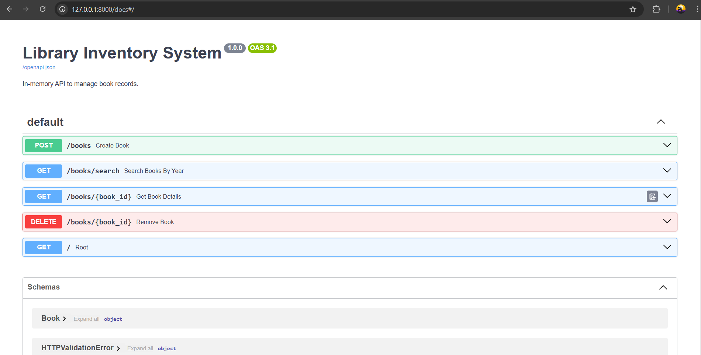
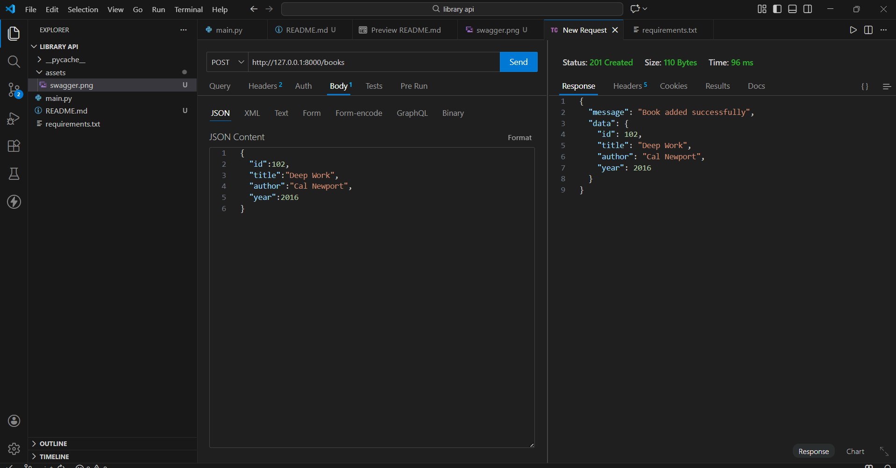
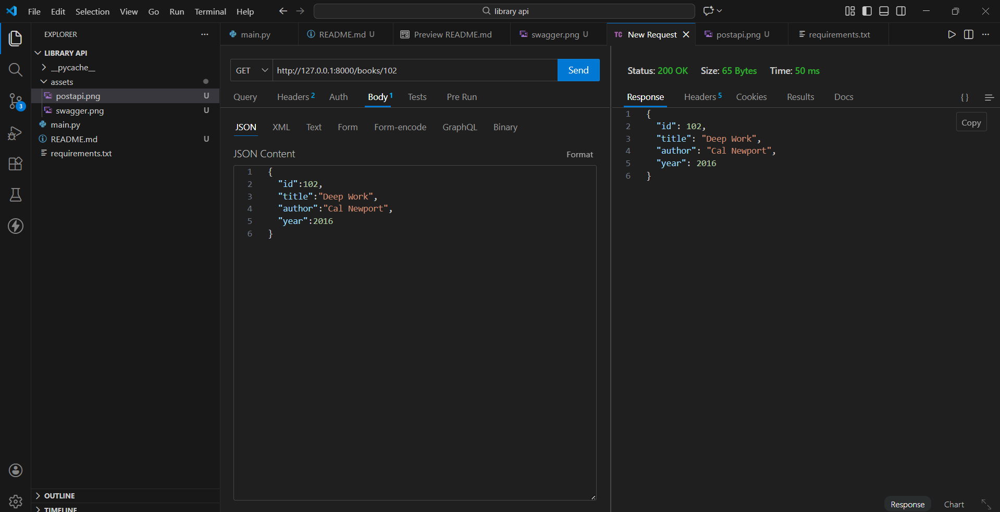
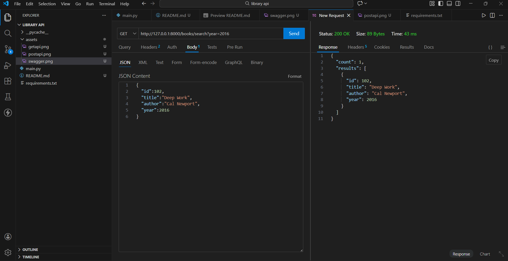
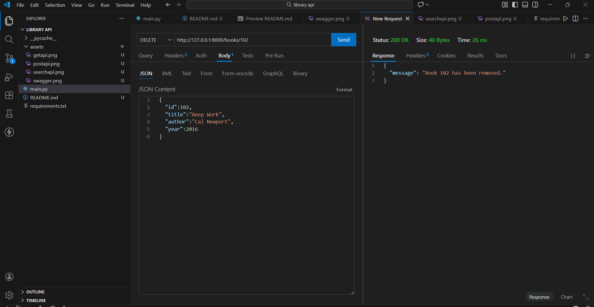

# In-Memory Library API

A lightweight RESTful API built with FastAPI to manage a book inventory. This system uses volatile in-memory storage (Python lists) to perform CRUD operations without requiring an external database setup.


*(Screenshot: The API running locally with interactive Swagger documentation)*


*(Screenshot: The API running locally with interactive post api documentation)*



*(Screenshot: The API running locally with interactive get api documentation)*



*(Screenshot: The API running locally with interactive search api documentation)*



*(Screenshot: The API running locally with interactive delete api documentation)*


## Project Title & Goal
**Goal:** Build a working backend API that allows users to Add, Retrieve, Search, and Delete books.
**Constraint:** The solution runs locally and uses strictly in-memory storage (no SQL/NoSQL database required).

## Setup Instructions

Follow these commands to run the project on your machine.

**1. Clone the Repository**
```bash
1.git clone [https://github.com/kapilpatel1011/library_api.git](https://github.com/kapilpatel1011/library_api.git)
cd library_api

2. Install Dependencies
pip install -r requirements.txt

3. Run the Server
uvicorn main:app --reload

4. Test the API Open your browser and navigate to the automatic documentation: http://127.0.0.1:8000/docs


The Logic (How I Thought)
1. Why did you choose this approach?
I chose FastAPI over Flask because it offers:

Automatic Validation: Using Pydantic models (class Book(BaseModel)) ensures that invalid data (like a string for a 'year') is rejected automatically with clear error messages.

Built-in Documentation: It generates the Swagger UI (/docs) automatically, which saves development time.

In-Memory Storage: I used a simple Python list to store the book objects. This keeps the application extremely fast (O(1) complexity for appending) and avoids the overhead of setting up a local database server for this specific challenge.

2. What was the hardest bug you faced?
The "Route Ordering" Conflict: Initially, I placed the GET /books/{book_id} route before the GET /books/search route. When I tried to search, the API thought the word "search" was an ID and tried to convert it to an integer, causing a crash (422 Error).

Fix: I realized that FastAPI reads routes from top to bottom. I moved the specific /books/search endpoint above the dynamic /books/{book_id} endpoint to ensure requests were routed correctly.

API Endpoints

Method      Endpoint       Description
POST        /books         Add a new book to the library.
GET         /books/{id}     Retrieve details of a specific book.
GET         /books/search"  Search for books by publication year (e.g., ?year=2024)."
DELETE      /books/{id}     Remove a book from the inventory.


Future Improvements
If I had 2 more days, I would add:

Persistent Storage: Integrate SQLite so data is saved even after the server restarts.

Unit Testing: Add pytest scripts to automate testing for edge cases (e.g., negative years or duplicate IDs).

Docker Support: Create a Dockerfile to containerize the application for easier deployment.